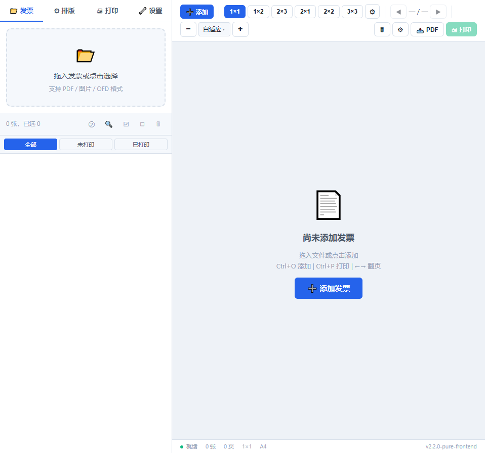
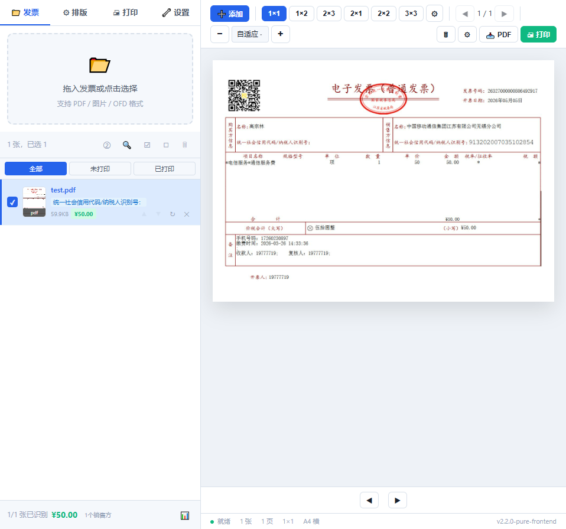

# 发票酱 (TicketChan)

[](LICENSE)
[]()
[]()
[]()

**纯前端电子发票批量排版打印工具**。单页应用,零后端,零构建,浏览器即开即用。

> **🕸️ 在线体验**：[https://fapiao.erma0.cn](https://fapiao.erma0.cn)



## ✨ 功能

- **多格式**: PDF / OFD / XML 数电票 / JPG / PNG / BMP / WebP / GIF
- **字段提取**: PDF 文字层 / OFD XML / XML 数电票自动提取发票信息
- **多张拼版**: 自定义 1-10×1-10 网格,A4/A5/B5/Letter/Legal/自定义纸张
- **完整排版控制**: 边距、间距、缩放、旋转、切割线、边框、水印、页码、页脚
- **单票独立调整**: 拖拽移动 + 滚轮缩放 (5%/步) + 九宫格对齐 + 调整记忆
- **汇总表**: 14 字段可勾选 / 双击编辑 / 备注列 / 3 种金额合计 / CSV 导出 (UTF-8 BOM)
- **打印状态追踪**: 全部/未打印/已打印过滤,打印后自动标记
- **日期排序**: 按开票日期升序/降序排列
- **排版份数**: 批量设置选中发票排版份数 (×1/×2/×3)
- **PDF 矢量嵌入**: pdf-lib embedPage 直接嵌入原始 PDF 页面,保留矢量+印章
- **保存 PDF**: 保存矢量 PDF (Ctrl+S)，支持保存非矢量图片 PDF（无需 CJK 字体）
- **打印**: 浏览器原生 `<iframe>.print()` 打印,PDF 矢量保真
- **离线**: 无需网络,全浏览器运行
- **设置持久化**: 排版参数/水印/页脚/汇总列等自动记忆
- **主题切换**: 浅色/深色



## 🚀 部署

上传到任何静态托管即可:

```bash
python3 -m http.server 8080
# 访问 http://localhost:8080/
```

- **Vercel** / **Netlify** / **Cloudflare Pages** / **GitHub Pages** — 拖入根目录即部署
- **对象存储** (OSS / S3 / COS) — 开启静态网站托管
- **公司内网** — nginx / Apache / IIS

需正确返回 `.mjs` 的 `application/javascript` MIME。建议启用 gzip/brotli (vendor gzip 后约 800KB)。

## 📁 目录结构

```
fapiao/
├── index.html
├── css/styles.css
├── js/
│   ├── app.js              # 主应用 (文件加载/状态/汇总/CSV)
│   ├── print.js            # pdf-lib 拼版 + iframe.print()
│   ├── layout.js           # 排版计算 + 预览渲染
│   ├── pdf-client.js       # PDF.js 封装 (ESM)
│   ├── pdf-text.js         # PDF 文字层提取
│   ├── ofd-client.js       # OFD 前端解析
│   ├── xml-client.js       # XML 数电票解析
│   ├── xml-utils.js        # 共享 XML 工具
│   └── idb-store.js        # IndexedDB 存储 (ESM)
├── vendor/                 # 第三方库 (~2.7MB)
│   ├── pdf.min.mjs / pdf.worker.min.mjs   # PDF.js 4.10
│   ├── pdf-lib.min.js                     # pdf-lib 1.17
│   ├── fontkit.umd.min.js                 # 字体解析
│   ├── jszip.min.js                       # JSZip
│   └── cmaps/                             # CJK 字符映射
├── screenshots/            # README 截图
├── CHANGELOG.md / README.md / LICENSE
└── .gitignore
```

## 🔧 技术栈

| 用途 | 库 | 许可 |
|---|---|---|
| PDF 渲染 | PDF.js 4.10 | Apache 2.0 |
| PDF 拼版 | pdf-lib 1.17 | Apache 2.0 |
| 字体解析 | fontkit | MIT |
| ZIP 解压 | JSZip | MIT |
| 文件存储 | IndexedDB (浏览器原生) | — |
| 打印 | 浏览器原生 `<iframe>.print()` | — |

总 vendor: **~3MB** (gzip 后约 1MB)

## 🌐 浏览器要求

需要支持以下 API 的现代浏览器:
- ES2020 + 动态 import
- `<iframe>.print()` 打印对话框
- `Local Font Access API` (`window.queryLocalFonts`) — Chrome/Edge 103+ 自动读取系统 CJK 字体,实现零下载

## 📝 版本

- **v3.1.0** (本分支): 纯前端,零后端零依赖 — 🕸️ 在线试用 [fapiao.erma0.cn](https://fapiao.erma0.cn)
- **v2.0.9** ([`master` 分支](https://github.com/erma0/fapiao-print/tree/master)): Tauri 桌面版,Rust 后端 + PDFium 引擎,支持静默打印/打印机选择/批量重命名

## ⚠️ 与桌面版的差异

纯 Web 版因浏览器安全限制，以下功能不可用：
- **批量重命名**: 无法访问本地文件系统重命名文件
- **打印机选择**: 浏览器无法指定打印机，只能调出打印对话框
- **文件列表记忆**: 无法持久化本地文件路径跨会话恢复
- **静默打印**: 必须经过浏览器打印对话框
- **矢量 PDF 部分 CJK 文字缺失**: Web 版用 pdf-lib 的 `embedPage` 做矢量直通，对部分嵌入的 Type0/CID 字体存在已知缺陷，可能导致少量文字（如「下载次数」）在保存的矢量 PDF 中丢失。桌面版用 PDFium 引擎无此问题。如需完整文字保真，请用「保存图片 PDF」按钮（位图模式，文字 100% 保留）。

如需以上功能，请使用 [Tauri 桌面版](https://github.com/erma0/fapiao-print/tree/master)。

> 🕸️ **Web 版**：[fapiao.erma0.cn](https://fapiao.erma0.cn) | 源码 [`web` 分支](https://github.com/erma0/fapiao-print/tree/web)
