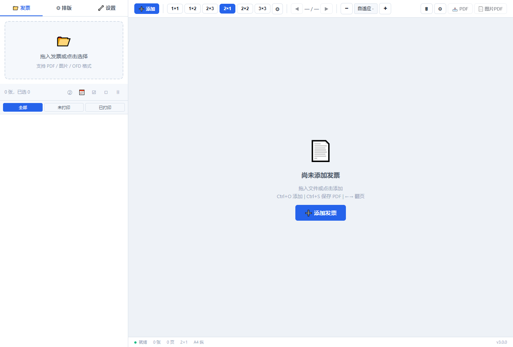
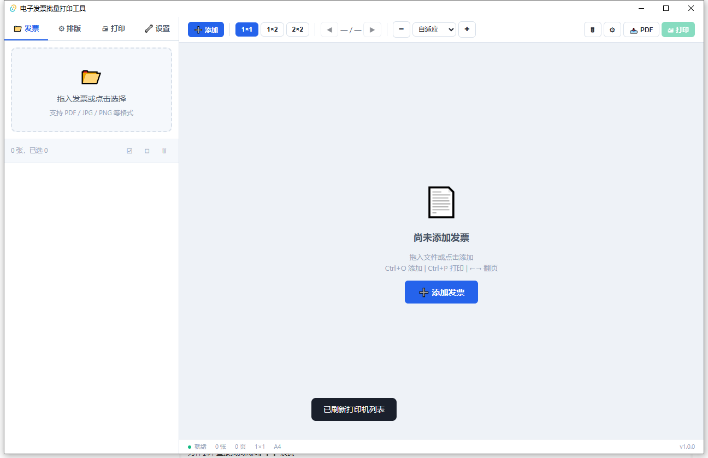

# 📄 发票酱 (TicketChan)

[](LICENSE)
[]()
[]()
[]()

**纯 Web 部署的电子发票批量打印工具**。单二进制 `ticketchan-server`,浏览器即开即用,支持 Docker / 裸金属 / 本地三种部署形态。

> 💡 v2.1.0 已彻底移除 Tauri 桌面壳。前端是无框架 HTML/CSS/JS,后端是 Axum HTTP Server + 25 个 REST 端点 + SSE 进度推送,客户端用任意现代浏览器即可访问。

支持 **轻量版**（无 OCR）和 **OCR 版**（含 PP-OCRv5 智能识别,`--features ocr` 启用）。

## ✨ 功能特性

### 🏆 OFD 完整支持

OFD（开放版式文档）是国家标准电子发票格式,本工具提供原生完整支持 — 矢量渲染、发票信息直提、印章保真,拖入即用,无需 OCR。

> ⚠️ 不同厂商/转换工具生成的 OFD 发票格式存在差异（如税务原版 OFD、iloveofd 转换、dzcp 公共服务平台等）,如遇解析渲染问题请及时反馈,我们会持续适配。

### 📥 文件管理

- **多格式支持**: PDF、OFD、XML 数电票、JPG、PNG、BMP、WebP、TIFF
- **XML 数电票**（v2.0.7）: 解析 `<EInvoice>` 格式,提取发票号码/日期/金额/买卖方信息,汇总表、CSV 导出、批量重命名全兼容;纯数据格式不参与排版打印
- **文件列表记忆**（v2.0.7）: 可选开关,启动时自动恢复上次打开的文件列表,仅记忆文件路径
- **打印状态追踪**（v2.0.7）: 三种过滤（全部/未打印/已打印）,打印后自动标记绿色 ✓,状态持久化
- **PDF 渲染**: PDFium 位图渲染(`FPDF_LoadMemDocument` + `FPDF_RenderPageBitmap`),跨平台统一
- **PDF 文字层提取**（轻量版也可用）: 解析 PDF 内容流 Tm+Tj/TJ 指令直接提取文字坐标,~5ms/页,无需 OCR 即可识别发票信息
- **PP-OCRv5 智能识别**（OCR 版,适用于图片型 PDF 和图片）: 文本优先 + 坐标回退双重架构,含税价 / 不含税价 / 税额数学验证配对,发票号码 / 日期 / 买卖方信息自动提取
- **金额校验可视化**: OCR / PDF 提取金额求和校验失败时,发票卡片金额徽章 ⚠ 警告标识,hover 可查看含税/不含税/税额验证详情
- **EXIF 方向自动修正**: 导入图片/车票时自动读取 EXIF Orientation 旋转像素,PDF /Rotate 属性 + CropBox 坐标归一化保障页面方向正确
- **发票查验**: 一键跳转国家税务总局查验平台
- **骨架屏渐进加载**: 批量导入时骨架屏秒出 + 逐文件渐进渲染 + 持久进度 toast,大文件不卡 UI
- **↑↓ 排序**: ↑↓ 按钮排序,hover 浮动显示不占空间
- **批量重命名**（v2.0.5）: 汇总表内嵌面板,预设模板（金额+销售方+号码等）或自定义字段勾选,一键批量重命名发票磁盘文件,重名自动序号
- **设置自动记忆**: 关闭后自动记住布局、纸张、打印模式等全部设置,打开即恢复

### 📐 排版设置

- **纸张**: A4 / A5 / B5 / Letter / Legal / 自定义
- **布局**: 6 预设（1×1 / 2×1 / 3×2 / 1×2 / 2×2 / 3×3）+ 自定义行列（1-10 × 1-10）,自动横纵方向
- **边距 / 间距**: 独立可调,预设快捷按钮
- **缩放**: 自适应 / 拉伸填充 / 原始大小 / 自定义百分比
- **旋转**: 全局 0° / 90° / 180° / 270° / 自动 + 单张旋转
- **单票独立调整**（v1.9.0+,v2.0.1-v2.0.2 增强）: 每张发票预览拖拽移动 + 角落 handle 缩放,九宫格快速对齐,滚轮微调 + 滚轮单票缩放（5%/步）,±150mm 偏移范围,拖拽约束动态化,放大上限 3x,编辑态溢出预览,双击重置,调整参数可选持久化记忆,侧边栏「单票调整」面板或发票弹窗参数编辑,PDF 按参数裁剪输出

### ✂️ 辅助功能

- 裁切线、编号标记、边框显示、裁剪白边、自定义水印
- 金额统计、车票票种标签、发票类型自动检测
- **页脚**: 打印页码（第 X 页 / 共 Y 页）、打印日期、自定义页脚文本,独立下边距控制

### 📊 数据导出

- **发票汇总表**（v2.0.3）: 报销必备,一键导出所有发票明细,字段可勾选（14 项）,金额/名称等可直接编辑修正,合计行自动汇总含税/不含税/税额,CSV 格式 Excel 直接打开,列选择和备注持久化记忆

### 🖨️ 打印与导出

- **打印模式**（v2.1.0 缩减为 3 种,SumatraPDF 已移除）:
  - **PDF 阅读器**（默认）: 生成 PDF 后由系统默认程序处理,保持矢量质量,数据量最小
  - **弹窗确认**: 预览后确认打印,可选 PDFium 引擎
  - **静默打印（PDFium）**: Chromium PDFium 引擎直打打印机 DC,打印清晰（需下载 pdfium.dll）
- **PDF 统一直通**（v1.9.0+）: lopdf Form XObject + JPEG DCTDecode 直通,PDF 页面以原始质量嵌入合成 PDF,无二次压缩
- **印章烘焙**（v2.0.4）: 生成 PDF 时自动将原票印章/签章标注烘焙到输出,印章位置/大小与原票一致
- **份数控制**: 全局 + 单张份数,逐份 / 逐页打印,双面打印,彩色 / 灰度 / 黑白
- **PDF 导出**: 自动打开或自定义保存目录
- **确认弹窗**: 打印前显示发票数量 / 版面 / 纸张 / 打印机 / 引擎 / 份数,防止误操作

### 🎨 界面

- 深色 / 浅色模式、实时预览（缩放 + 翻页）
- **快捷键**: `Ctrl+O` 添加 · `Ctrl+P` 打印 · `Ctrl++/-` 缩放 · `Ctrl+0` 自适应 · `←→` 翻页

## 📸 界面预览

<table>
  <tr>
    <td align="center">☀️ 浅色模式</td>
    <td align="center">🌙 深色模式</td>
  </tr>
  <tr>
    <td></td>
    <td></td>
  </tr>
</table>

## 📦 部署与下载

### Web 版（v2.1.0 唯一发布形态）

**Docker（推荐）**:

```bash
# 拉取并运行
docker run -d \
  --name ticketchan \
  -p 3000:3000 \
  -v ticketchan-sessions:/tmp/ticketchan \
  -e TICKETCHAN_AUTH_TOKEN=your-secret-here \
  ghcr.io/erma0/ticketchan-server:latest

# 访问 http://localhost:3000
```

**Docker Compose**:

```bash
git clone https://github.com/erma0/fapiao-print.git
cd fapiao-print
docker compose up -d
```

**裸金属（Linux 服务器）**:

```bash
# 安装依赖（Debian/Ubuntu）
sudo apt install libpdfium-dev

# 编译
cargo build --release --bin ticketchan-server

# 前端文件部署
sudo mkdir -p /opt/ticketchan/frontend
sudo cp -r frontend/* /opt/ticketchan/frontend/

# 启动（systemd）
sudo cp ticketchan.service /etc/systemd/system/
sudo systemctl daemon-reload
sudo systemctl enable --now ticketchan

# 或者直接启动
TICKETCHAN_FRONTEND_DIR=/opt/ticketchan/frontend \
TICKETCHAN_AUTH_TOKEN=your-secret \
./target/release/ticketchan-server
```

**Windows 本地运行**:

```powershell
cargo build --release --bin ticketchan-server
$env:TICKETCHAN_FRONTEND_DIR = "$PWD\frontend"
$env:TICKETCHAN_AUTH_TOKEN = "dev-token"
.\target\release\ticketchan-server.exe
# 浏览器打开 http://127.0.0.1:3000
```

**环境变量**:

| 变量 | 默认 | 说明 |
|------|------|------|
| `TICKETCHAN_SERVER_PORT` | `3000` | HTTP 监听端口 |
| `TICKETCHAN_BIND_ADDR` | `127.0.0.1` | 绑定 IP,公网用 `0.0.0.0` (需配 AUTH_TOKEN) |
| `TICKETCHAN_AUTH_TOKEN` | (无) | Bearer Token 认证 |
| `TICKETCHAN_FRONTEND_DIR` | `./frontend` | 前端静态文件目录 |
| `TICKETCHAN_SESSION_DIR` | `<temp>/ticketchan` | Web session 临时文件目录 |

> 💡 文字型 PDF / OFD 发票选轻量版即可自动提取金额和销售方信息;图片型 PDF 和图片需 OCR 版（编译时加 `--features ocr`）。

**⚠️ 公网部署安全提示**: 设置 `TICKETCHAN_BIND_ADDR=0.0.0.0` 时**必须**配置 `TICKETCHAN_AUTH_TOKEN` 或外层反向代理鉴权,否则任何人都能访问你的发票数据。

## 📋 使用说明

1. **部署服务**: 选择上面任一部署方式,启动后访问 `http://<host>:3000`
2. **添加发票**: 浏览器中点击「➕ 添加」或拖放文件（支持 PDF / OFD / 图片混选）
3. **排版设置**: 左侧「⚙ 排版」面板调整纸张、布局、边距
4. **预览检查**: 主区域实时预览,支持缩放翻页;文字型 PDF / OFD 自动提取金额信息,图片型 PDF 和图片需 OCR 版
5. **打印**: 点击「🖨 打印」,选择弹出预览或直接打印（**注意: 静默打印走本机打印机,Web 部署时为服务器端打印机**）
6. **保存 PDF**: 点击「📥 PDF」导出合成 PDF,自动下载到本地

## 🛠 技术栈

| 层级 | 技术 | 说明 |
|------|------|------|
| 前端 | 原生 HTML/CSS/JS | 模块化（app / ocr / layout / print / api）,零依赖框架,浏览器直接加载 |
| 通信 | Axum 0.8 + Tokio | REST API + SSE 进度推送,`fetch()` 统一调用 |
| 后端 | Rust 1.77+ | 单二进制 `ticketchan-server`,异步 + spawn_blocking 处理 CPU 密集任务 |
| PDF 渲染 | PDFium 位图渲染 | 跨平台统一,通过 `render_pdf_pages_pdfium` 调用 |
| PDF 生成 | printpdf 0.9 + lopdf 0.39 | JPEG 直通零质量损失、PDF 页面 Form XObject 全布局直通 |
| OFD/XML 解析 | Rust 独立 crate (`invoice-engine/`) | 矢量 SVG 渲染 + 发票 XML/数电票字段直提 |
| OCR | ocr-rs 2.2 (PP-OCRv5 + MNN) | 文本优先 + 坐标回退,对比度增强（OCR 版 `--features ocr` 可选） |
| 打印 | Print Spooler API + PDFium | 静默打印 / 弹窗确认 / PDF 阅读器（Windows） |
| Web 部署 | Axum + Nginx + Docker + systemd | REST API + Session 管理 + Token 认证 + SSE `proxy_buffering off` |

## 📁 项目结构

```
fapiao/
├── Cargo.toml                    # 单一 crate,只构建 ticketchan-server
├── Cargo.lock
├── build.rs                      # 编译 Windows SEH 包装器
├── Dockerfile                    # 多阶段构建 (rust:1.82 → debian-slim)
├── docker-compose.yml
├── deploy.sh                     # 构建+推送脚本
├── nginx.conf                    # 反向代理 + CORS + gzip + SSE
├── ticketchan.service            # systemd unit
├── src/                          # Rust 后端 (8250 行)
│   ├── main.rs                   # 入口,加载环境变量 + AppState
│   ├── lib.rs                    # app_lib,导出模块 + 共享工具
│   ├── server.rs                 # Axum 路由 + 25 个 REST handler
│   ├── session.rs                # Web session 管理 (24h TTL)
│   ├── pdf_engine.rs             # 5819 行,核心 PDF 排版/生成/打印
│   ├── pdfium_bindings.rs        # FFI 绑定
│   ├── pdfium_render.rs          # 跨平台位图渲染
│   ├── pdfium_print.rs           # Windows GDI 矢量打印
│   ├── platform.rs               # 平台抽象层
│   └── seh_wrapper.c             # Windows SEH 保护
├── invoice-engine/               # OFD + XML 数电票解析 (独立 crate)
├── frontend/                     # 浏览器前端
│   ├── index.html
│   ├── css/styles.css
│   └── js/{api,app,layout,ocr,print}.js
├── models/                       # OCR 模型 (PP-OCRv5, MNN)
├── sample/                       # 测试样例
├── screenshots/                  # README 截图
├── docs/                         # 专题文档
└── target/                       # 编译产物
```

## 🚀 开发

**环境要求**: Rust 1.77+、可选 Node.js 18+（仅用于辅助脚本）、Windows 10/11 / Linux / macOS

### 本地开发

```bash
# 克隆
git clone https://github.com/erma0/fapiao-print.git
cd fapiao-print

# 启动服务（开发模式,绑定 127.0.0.1:3000,前端热刷新 = 浏览器 Ctrl+R）
cargo run --release --bin ticketchan-server

# 浏览器打开 http://127.0.0.1:3000

# OCR 版
cargo run --release --bin ticketchan-server --features ocr
```

### 编译检查（仅验证,不运行）

```bash
cargo check                              # 轻量版
cargo check --features ocr               # OCR 版
cargo check --bin ticketchan-server      # 同上,显式指定二进制
```

### Docker 构建

```bash
# 构建镜像
docker build -t ticketchan-web .

# 启动
docker compose up -d

# 查看日志
docker logs -f ticketchan
```

### 清理历史产物

```bash
# v2.1.0 之前残留的桌面二进制 (target/release/ 下)
rm -f target/release/{fapiao-print.exe,ticketchan.exe,发票打印工具*.exe}
```

## 🗺 路线图

- [x] OFD 完整支持
- [x] PDF 全布局直通
- [x] 单票独立调整
- [x] Print Spooler API 静默打印
- [x] PDFium 矢量静默打印
- [x] OCR Feature Flag 双版本构建
- [x] PDF 文字层提取
- [x] 设置持久化 / 金额校验可视化
- [x] 发票汇总表导出
- [x] 批量重命名发票文件
- [x] XML 数电票支持
- [x] 文件列表记忆 / 打印状态追踪（v2.0.7）
- [x] **纯 Web 重构 + Docker/systemd 部署**（v2.1.0,移除 Tauri 桌面壳）
- [ ] Docker OCR 版（MNN 模型分层优化）
- [ ] LDAP/OIDC 用户认证
- [ ] PWA 离线支持
- [ ] 水平扩展（对象存储 + Redis Session）

## 🤖 关于此项目

本项目由 AI 辅助生成,历经 200+ 轮迭代。v2.1.0 是一次彻底的架构简化:

- **从 Tauri 桌面壳到纯 Web**: 移除 Tauri、tauri-cli、tauri.conf.json、NSIS 打包,只剩单二进制 `ticketchan-server` + 浏览器静态文件
- **从 src-tauri/ 到根 src/**: 简化目录结构,减少嵌套层级
- **从混合通信到统一 HTTP**: 桌面版 / Web 版两套调用路径合并,前端 `__api.call()` 走 fetch(),无 IPC fallback
- **从 SumatraPDF 三引擎到 PDFium 单引擎**: 减少 ~600 行第三方进程管理代码
- **从分平台配置到统一配置**: 移除 `tauri.conf.json` / `tauri.ocr.conf.json` / `package.json` 多份配置,版本号统一在 `Cargo.toml`

主要攻克的技术点: Tauri 2.x 对话框死锁、WebView2 拖放失效、WinRT COM 接口适配、ocr-rs 条件编译集成、OFD 矢量渲染（DrawParam 继承链 / 印章偏移 / ImageMask 遮罩合成）、PDF 引擎 JPEG 直通与 lopdf Form XObject 全布局直通、PDFium 矢量打印（DLL 生命周期管理 / SEH 原生崩溃保护）、PDF 文字层坐标提取（rayon 并行）、跨平台改造（Axum HTTP Server 嵌入 / 平台抽象层 / Docker Web 部署 / SSE 进度推送 / 路径穿越防护 / Token 认证）。

## 📄 许可证

[MIT License](LICENSE)

## Star History

[](https://star-history.com/#erma0/fapiao-print&type=Date)
